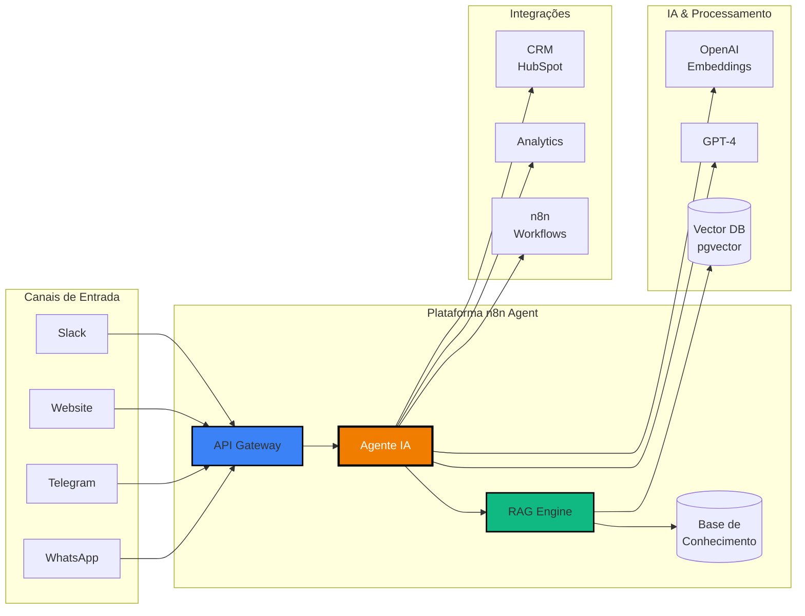
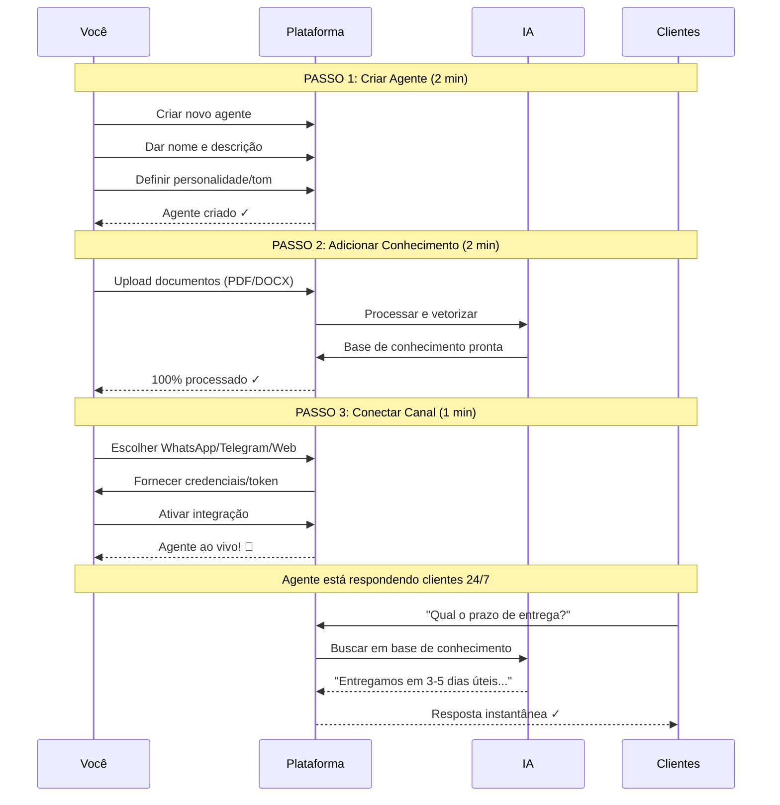
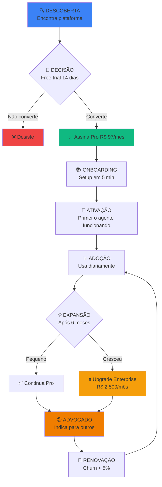
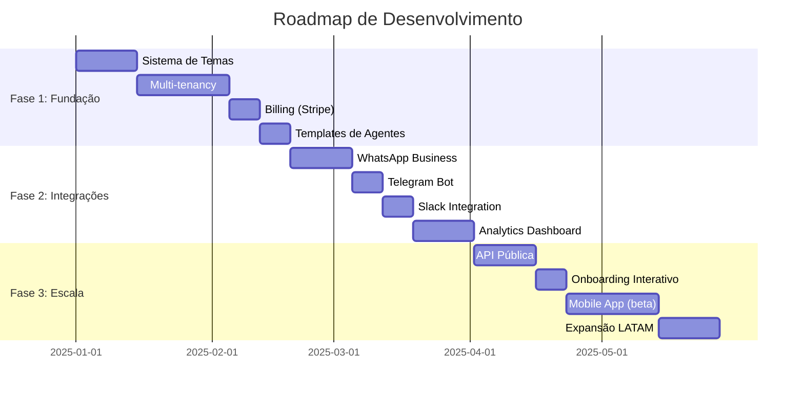
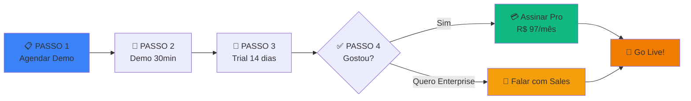

# 💼 Proposta Comercial - Plataforma de Agentes IA

**Dashboard White-Label para Automatizar Atendimento com Inteligência Artificial**

---

## 📋 Sumário Executivo

### O Problema

```
┌─────────────────────────────────────────────────────────┐
│                                                         │
│   Empresas brasileiras perdem R$ 1.2 TRILHÕES/ano     │
│   com atendimento ineficiente (McKinsey, 2024)        │
│                                                         │
│   • 70% das perguntas são REPETITIVAS                 │
│   • Tempo médio de resposta: 4-8 HORAS                │
│   • Custo por atendente: R$ 2.500/mês                 │
│   • Atendimento apenas 8h-18h (seg-sex)               │
│                                                         │
└─────────────────────────────────────────────────────────┘
```

### Nossa Solução

**Plataforma no-code** que permite criar agentes de IA em **5 minutos**, custando **40x menos** que atendimento humano.

---

## 🎯 Proposta de Valor

### Diagrama: Antes vs Depois

```mermaid
graph TB
    subgraph "ANTES - Atendimento Tradicional"
        A1[Cliente envia mensagem] --> A2[Fila de espera: 2-4h]
        A2 --> A3[Atendente humano responde]
        A3 --> A4[Procura informação manualmente]
        A4 --> A5[Responde cliente: 30min]
        A5 --> A6[Custo: R$ 2.500/mês por pessoa]
    end
    
    subgraph "DEPOIS - Com Agente IA"
        B1[Cliente envia mensagem] --> B2[IA processa: 2 segundos]
        B2 --> B3[Busca em base de conhecimento]
        B3 --> B4[Responde automaticamente]
        B4 --> B5[Custo: R$ 97/mês ilimitado]
    end
```



### Comparativo Visual

| Métrica | Atendimento Humano | Agente IA | Economia |
|---------|-------------------|-----------|----------|
| **Tempo de resposta** | 2-4 horas | 2-5 segundos | **99.9%** ⚡ |
| **Disponibilidade** | 44h/semana (8h-18h) | 168h/semana (24/7) | **282%** 🌙 |
| **Custo mensal** | R$ 2.500 | R$ 97 | **R$ 2.403** 💰 |
| **Capacidade** | ~50 msgs/dia | Ilimitado | **∞** 🚀 |
| **Taxa de erro** | 15-20% | <2% | **90%** ✅ |
| **Treinamento** | 2-4 semanas | 5 minutos | **99.9%** ⏱️ |

---

## 🏗️ Arquitetura da Solução

### Diagrama de Fluxo Completo



### Componentes Principais

```
┌─────────────────────────────────────────────────────────────┐
│                                                             │
│  📱 CAMADA DE CANAIS                                        │
│  ├─ WhatsApp Business API                                  │
│  ├─ Telegram Bot                                           │
│  ├─ Widget Web (chat embed)                                │
│  ├─ Slack / Discord / Teams                                │
│  └─ API REST (integrações custom)                          │
│                                                             │
├─────────────────────────────────────────────────────────────┤
│                                                             │
│  🤖 MOTOR DE IA (RAG - Retrieval Augmented Generation)     │
│  ├─ Vector Search (pgvector)                               │
│  ├─ OpenAI Embeddings (text-embedding-3)                   │
│  ├─ GPT-4 Turbo (geração de respostas)                     │
│  └─ Context Window: 128k tokens                            │
│                                                             │
├─────────────────────────────────────────────────────────────┤
│                                                             │
│  📚 BASE DE CONHECIMENTO                                    │
│  ├─ Upload: PDF, DOCX, XLSX, TXT                           │
│  ├─ Chunking inteligente (500-1000 tokens)                 │
│  ├─ Vetorização automática                                 │
│  └─ Busca semântica (não keyword)                          │
│                                                             │
├─────────────────────────────────────────────────────────────┤
│                                                             │
│  🔌 INTEGRAÇÕES                                             │
│  ├─ n8n (workflows automáticos)                            │
│  ├─ CRM (HubSpot, Pipedrive, Salesforce)                   │
│  ├─ E-commerce (Shopify, WooCommerce)                      │
│  └─ Analytics (Dashboards customizados)                    │
│                                                             │
└─────────────────────────────────────────────────────────────┘
```

---

## 💡 Como Funciona (3 Passos)

### Diagrama de Setup



### Setup Visual

```
┌─────────────────────────────────────────────────────────┐
│                                                         │
│  ⏱️  TEMPO TOTAL: 5 MINUTOS                             │
│                                                         │
│  ┌──────────────┐     ┌──────────────┐     ┌─────────┐│
│  │   PASSO 1    │ --> │   PASSO 2    │ --> │ PASSO 3 ││
│  │              │     │              │     │         ││
│  │ Criar Agente │     │ Add Docs     │     │ Conectar││
│  │              │     │              │     │ Canal   ││
│  │  (2 min)     │     │  (2 min)     │     │ (1 min) ││
│  └──────────────┘     └──────────────┘     └─────────┘│
│                                                         │
│  🎯 RESULTADO: Agente funcionando 24/7                  │
│                                                         │
└─────────────────────────────────────────────────────────┘
```

---

## 📊 Casos de Uso Reais

### 1. E-commerce: "Loja de Roupas Fashion"

```
┌─────────────────────────────────────────────────────┐
│  ANTES                                              │
├─────────────────────────────────────────────────────┤
│  • 150 mensagens/dia no WhatsApp                   │
│  • 2 atendentes: R$ 5.000/mês                      │
│  • Atendimento 9h-18h (seg-sáb)                    │
│  • Tempo médio de resposta: 3h                     │
│  • Taxa de conversão: 12%                          │
│  • Vendas mensais: R$ 80k                          │
└─────────────────────────────────────────────────────┘
                        ↓
                   IMPLEMENTOU
                  AGENTE IA (Mai/2024)
                        ↓
┌─────────────────────────────────────────────────────┐
│  DEPOIS (3 MESES)                                   │
├─────────────────────────────────────────────────────┤
│  • 300 mensagens/dia (IA responde 80%)             │
│  • 1 atendente humano: R$ 2.500/mês + R$ 97 IA    │
│  • Atendimento 24/7 (365 dias)                     │
│  • Tempo médio de resposta: 8 segundos             │
│  • Taxa de conversão: 18% (+50%)                   │
│  • Vendas mensais: R$ 125k (+56%)                  │
│                                                     │
│  💰 ECONOMIA: R$ 2.403/mês                          │
│  📈 AUMENTO VENDAS: +R$ 45k/mês                     │
│  🎯 ROI: 1.772% (retorno em 3 dias!)               │
└─────────────────────────────────────────────────────┘
```

**Depoimento:**
> *"O agente responde 80% das perguntas sozinho. Economizei um salário inteiro e ainda vendo mais porque atendo 24/7. Melhor investimento que já fiz!"*
> 
> — Maria Silva, Proprietária

---

### 2. SaaS B2B: "Software de Gestão"

```
┌─────────────────────────────────────────────────────┐
│  DESAFIO                                            │
├─────────────────────────────────────────────────────┤
│  • 500 tickets/mês no suporte                      │
│  • 3 analistas de suporte: R$ 12.000/mês          │
│  • SLA de 24h não cumprido (30% atrasados)        │
│  • Churn alto: 8%/mês (clientes insatisfeitos)    │
└─────────────────────────────────────────────────────┘

                        ↓
                    SOLUÇÃO
                        ↓

┌─────────────────────────────────────────────────────┐
│  AGENTE IA "HELPER"                                 │
├─────────────────────────────────────────────────────┤
│  Base de conhecimento:                              │
│  ├─ Documentação completa (200 páginas)            │
│  ├─ Tutoriais em vídeo (transcritos)              │
│  ├─ FAQ (150 perguntas)                            │
│  └─ Troubleshooting guide                          │
│                                                     │
│  Canais integrados:                                 │
│  ├─ Chat no app                                    │
│  ├─ Email (tickets automáticos)                    │
│  └─ Slack (clientes enterprise)                    │
└─────────────────────────────────────────────────────┘

                        ↓
                   RESULTADOS
                        ↓

┌─────────────────────────────────────────────────────┐
│  DEPOIS (6 MESES)                                   │
├─────────────────────────────────────────────────────┤
│  • 500 tickets/mês → 150 (70% resolvidos por IA)  │
│  • 1 analista + IA: R$ 4.097/mês                  │
│  • SLA cumprido: 98%                               │
│  • Churn reduzido: 3%/mês (-62%)                   │
│  • NPS aumentou: 35 → 68                           │
│                                                     │
│  💰 ECONOMIA: R$ 7.903/mês (R$ 94k/ano)            │
│  📊 REDUÇÃO CHURN: +R$ 180k/ano em receita         │
│  🎯 ROI: 282.000% anualizado                       │
└─────────────────────────────────────────────────────┘
```

---

### 3. Agência: Modelo White-Label

```
┌─────────────────────────────────────────────────────┐
│  AGÊNCIA DIGITAL "XYZ"                              │
├─────────────────────────────────────────────────────┤
│  • 20 clientes ativos                              │
│  • Oferece: Sites, Apps, Marketing                 │
│  • Quer: Novo produto recorrente (MRR)            │
└─────────────────────────────────────────────────────┘

                        ↓
              ADOTA NOSSA PLATAFORMA
                (White-Label Enterprise)
                        ↓

┌─────────────────────────────────────────────────────┐
│  NOVO PRODUTO: "Assistente IA by Agência XYZ"      │
├─────────────────────────────────────────────────────┤
│  Customização:                                      │
│  ├─ Logo e cores da agência                        │
│  ├─ Domínio próprio (ia.agenciaxyz.com.br)        │
│  ├─ Branding 100% white-label                      │
│  └─ Email automático com assinatura da agência     │
│                                                     │
│  Modelo de negócio:                                 │
│  ├─ Custo: R$ 2.500/mês (Enterprise)              │
│  ├─ Vende: R$ 497/mês por cliente                 │
│  └─ Margem: R$ 9.940/mês (20 clientes)            │
│                                                     │
│  Setup por cliente:                                 │
│  └─ 30 minutos (junior faz onboarding)             │
└─────────────────────────────────────────────────────┘

                        ↓
                   RESULTADOS (1 ANO)
                        ↓

┌─────────────────────────────────────────────────────┐
│  IMPACTO NO NEGÓCIO                                 │
├─────────────────────────────────────────────────────┤
│  • 20 clientes usando IA                           │
│  • Receita: R$ 9.940/mês = R$ 119k/ano            │
│  • Churn: 2% (produto sticky)                      │
│  • Upsell: 30% upgrade para planos maiores        │
│  • Novos clientes: +15/ano (indicação)            │
│                                                     │
│  💰 RECEITA ADICIONAL: R$ 119k/ano                 │
│  🎯 MARGEM: 80% (altíssima!)                       │
│  📈 CRESCIMENTO: 150%/ano em MRR                   │
│  ⭐ DIFERENCIAÇÃO: Único na região com IA          │
└─────────────────────────────────────────────────────┘
```

---

## 💰 Planos e Preços

### Diagrama de Comparação

```
┌─────────────┐      ┌─────────────┐      ┌─────────────┐
│    FREE     │      │     PRO     │      │ ENTERPRISE  │
├─────────────┤      ├─────────────┤      ├─────────────┤
│             │      │             │      │             │
│  R$ 5/mês   │      │ R$ 97/mês   │      │ R$ 2.500+   │
│             │      │             │      │             │
├─────────────┤      ├─────────────┤      ├─────────────┤
│             │      │             │      │             │
│ 3 agentes   │      │ 20 agentes  │      │ Ilimitado   │
│ 1k msg/mês  │      │ 50k msg/mês │      │ Ilimitado   │
│ 100 docs    │      │ 10k docs    │      │ Ilimitado   │
│ 1 canal     │      │ 10 canais   │      │ Todos       │
│             │      │             │      │             │
│ ❌ Branding │      │ ✅ Custom   │      │ ✅ White    │
│ ❌ API      │      │ ✅ API      │      │ ✅ Dedicado │
│             │      │             │      │             │
└─────────────┘      └─────────────┘      └─────────────┘
      │                    │                     │
      │                    │                     │
      ▼                    ▼                     ▼
  Freelancer           PMEs (80%)           Corporações
  Estudantes           Startups             Agências
  Validação            E-commerces          Franquias
```

### Calculadora de ROI

```
┌───────────────────────────────────────────────────────────┐
│                                                           │
│  CENÁRIO: Loja com 2 atendentes                          │
│                                                           │
│  CUSTO ATUAL:                                             │
│  ├─ 2 atendentes × R$ 2.500 = R$ 5.000/mês              │
│  ├─ Encargos (70%) = R$ 3.500/mês                       │
│  ├─ Treinamento = R$ 500/mês                            │
│  └─ TOTAL = R$ 9.000/mês                                │
│                                                           │
│  COM AGENTE IA:                                           │
│  ├─ 1 atendente × R$ 2.500 = R$ 2.500/mês               │
│  ├─ Encargos (70%) = R$ 1.750/mês                       │
│  ├─ Plataforma = R$ 97/mês                              │
│  └─ TOTAL = R$ 4.347/mês                                │
│                                                           │
│  ━━━━━━━━━━━━━━━━━━━━━━━━━━━━━━━━━━━━━━━━━━━━━━━━━━━━━│
│                                                           │
│  💰 ECONOMIA MENSAL: R$ 4.653                            │
│  💰 ECONOMIA ANUAL: R$ 55.836                            │
│  📊 REDUÇÃO DE CUSTO: 51,7%                              │
│  ⏱️  PAYBACK: 1 DIA (considerando 1º mês)                │
│  🎯 ROI: 4.795% ao ano                                   │
│                                                           │
│  📈 BENEFÍCIOS ADICIONAIS:                                │
│  ├─ Atendimento 24/7 (282% mais disponibilidade)        │
│  ├─ Resposta instantânea (99,9% mais rápido)            │
│  └─ Aumento de vendas estimado: 20-50%                  │
│                                                           │
└───────────────────────────────────────────────────────────┘
```

---

## 🚀 Jornada do Cliente

### Funil de Implementação



### Timeline de Valor

```
┌─────────────────────────────────────────────────────────┐
│                                                         │
│  DIA 1                                                  │
│  ├─ ✅ Cadastro (1 min)                                │
│  ├─ ✅ Criar primeiro agente (2 min)                   │
│  └─ ✅ Upload de documentos (2 min)                    │
│     └─> TEMPO TOTAL: 5 minutos                         │
│                                                         │
│  DIA 2                                                  │
│  ├─ ✅ Conectar WhatsApp/Telegram                      │
│  ├─ ✅ Primeiras 10 conversas teste                    │
│  └─ ✅ Ajustar prompts                                 │
│     └─> PRIMEIRO VALOR: Agente respondendo              │
│                                                         │
│  SEMANA 1                                               │
│  ├─ ✅ 100+ conversas automatizadas                    │
│  ├─ ✅ Feedback positivo de clientes                   │
│  └─ ✅ Primeiras vendas via IA                         │
│     └─> AHA MOMENT: "Isso realmente funciona!"         │
│                                                         │
│  MÊS 1                                                  │
│  ├─ ✅ 1.000+ conversas                                │
│  ├─ ✅ 80% resolvidas sem humano                       │
│  ├─ ✅ ROI positivo (economia > custo)                 │
│  └─ ✅ Decide assinar plano anual                      │
│     └─> COMMITMENT: Cliente fidelizado                  │
│                                                         │
│  MÊS 3                                                  │
│  ├─ ✅ 5.000+ conversas                                │
│  ├─ ✅ Integrou com CRM                                │
│  ├─ ✅ Adicionou mais agentes                          │
│  └─ ✅ Indicou para 2 parceiros                        │
│     └─> ADVOCATE: Promove ativamente                    │
│                                                         │
│  MÊS 6                                                  │
│  ├─ ✅ 15.000+ conversas                               │
│  ├─ ✅ Upgrade para Enterprise                         │
│  ├─ ✅ White-label ativado                             │
│  └─ ✅ Case study publicado                            │
│     └─> SUCCESS: História de sucesso                    │
│                                                         │
└─────────────────────────────────────────────────────────┘
```

---

## 🎯 Diferenciação Competitiva

### Matriz de Posicionamento

```
                    PREÇO
                      ↑
              CARO    │
                      │
    ┌─────────────────┼─────────────────┐
    │                 │                 │
    │   Intercom      │    Drift        │
    │   ($299/mês)    │   ($2.500/mês)  │
    │                 │                 │
────┼─────────────────┼─────────────────┼──── FEATURES
    │                 │                 │
    │   ManyChat      │  NÓS 🟠        │
    │   ($15/mês)     │  (R$ 97/mês)    │
    │                 │                 │
    └─────────────────┼─────────────────┘
              BARATO  │
                      ↓
              SIMPLES          COMPLETO
```

### Vantagens vs Concorrentes

```
┌─────────────────────────────────────────────────────────┐
│  VS INTERCOM                                            │
├─────────────────────────────────────────────────────────┤
│  ✅ 3x mais barato (R$ 97 vs $299)                      │
│  ✅ Interface em português                              │
│  ✅ Foco em PMEs brasileiras                            │
│  ✅ Suporte em PT-BR                                    │
│  ✅ White-label disponível                              │
│  ❌ Menos integrações (ainda)                           │
└─────────────────────────────────────────────────────────┘

┌─────────────────────────────────────────────────────────┐
│  VS MANYCHAT                                            │
├─────────────────────────────────────────────────────────┤
│  ✅ IA mais avançada (RAG vs flows)                     │
│  ✅ Múltiplos canais (não só social)                    │
│  ✅ Base de conhecimento inteligente                    │
│  ✅ Integração n8n (workflows)                          │
│  ❌ Não tem visual flow builder                         │
└─────────────────────────────────────────────────────────┘

┌─────────────────────────────────────────────────────────┐
│  VS CRISP                                               │
├─────────────────────────────────────────────────────────┤
│  ✅ RAG nativo (vs chatbot básico)                      │
│  ✅ Mais canais suportados                              │
│  ✅ Analytics mais robusto                              │
│  ✅ White-label completo                                │
│  ❌ Interface menos polida (por ora)                    │
└─────────────────────────────────────────────────────────┘
```

---

## 📈 Projeção de Crescimento

### Roadmap de Features (12 meses)



### Projeção Financeira Visual

```
  MRR (R$ mil)
      ↑
  200 │                                            ╱
      │                                          ╱
  150 │                                      ╱╱
      │                                  ╱╱
  100 │                            ╱╱╱
      │                      ╱╱╱
   50 │              ╱╱╱╱
      │      ╱╱╱╱
   10 │╱╱╱
      └─────┴─────┴─────┴─────┴─────┴─────┴───→ Tempo
        M1   M3   M6   M9   M12  M18  M24

  Marcos:
  M1:  R$ 5k   MRR  (10 clientes Pro)
  M3:  R$ 15k  MRR  (20 Pro + 2 Enterprise)
  M6:  R$ 40k  MRR  (50 Pro + 5 Enterprise)
  M12: R$ 120k MRR  (150 Pro + 15 Enterprise)
  M24: R$ 200k MRR  (300 Pro + 30 Enterprise)
```

---

## 🎁 Oferta Especial: Early Adopter

### Programa de Lançamento

```
┌─────────────────────────────────────────────────────────┐
│                                                         │
│  🚀 PROGRAMA EARLY ADOPTER                              │
│                                                         │
│  Seja um dos primeiros 100 clientes e ganhe:           │
│                                                         │
│  ✅ 50% OFF nos primeiros 6 meses                       │
│     └─> Plano Pro: R$ 48,50/mês (ao invés de R$ 97)   │
│                                                         │
│  ✅ Setup gratuito com especialista                     │
│     └─> Sessão de 1h para configurar tudo (R$ 300)    │
│                                                         │
│  ✅ Prioridade no suporte vitalício                     │
│     └─> Resposta em até 4h (vs 24h padrão)            │
│                                                         │
│  ✅ Acesso antecipado a novas features                  │
│     └─> Beta tester com voz ativa no roadmap          │
│                                                         │
│  ✅ Badge "Founding Member"                             │
│     └─> Reconhecimento público no site                 │
│                                                         │
│  💰 ECONOMIA TOTAL: R$ 591 nos primeiros 6 meses       │
│                                                         │
│  ⏰ VAGAS: 73/100 disponíveis                           │
│                                                         │
│  🎯 VÁLIDO ATÉ: 31/03/2025 ou até esgotar              │
│                                                         │
└─────────────────────────────────────────────────────────┘
```

---

## 📞 Próximos Passos

### Como Começar Agora



### 1️⃣ Agendar Demo (15 min)

📅 **Calendly:** [calendly.com/n8n-agents-demo](https://calendly.com)

**O que vamos mostrar:**
- ✅ Interface da plataforma (tour completo)
- ✅ Criar agente ao vivo (em 5 min)
- ✅ Testar conversas reais
- ✅ Ver analytics e métricas
- ✅ Calcular ROI específico do seu caso

### 2️⃣ Trial Gratuito (14 dias)

🎁 **Sem cartão de crédito necessário**

**Você recebe:**
- Plano Pro completo por 14 dias
- Suporte via chat e email
- Guias de setup personalizados
- Templates prontos para seu setor

### 3️⃣ Implementação Assistida

👨‍💻 **Nosso time ajuda você**

**Incluído no plano Pro:**
- Sessão de onboarding (30 min)
- Revisão de documentos
- Configuração de integrações
- Testes de qualidade

**Incluído no Enterprise:**
- Dedicação total (2-4h)
- Setup personalizado
- Treinamento da equipe
- Consultoria de prompts

---

## 💬 FAQ Comercial

### Perguntas Frequentes

**Q: Preciso saber programar?**
> A: Não! A plataforma é 100% no-code. Se você usa WhatsApp, vai saber usar.

**Q: Quanto tempo demora para ficar pronto?**
> A: 5 minutos para ter um agente funcionando. Refinamentos levam 1-2 horas.

**Q: Posso testar antes de pagar?**
> A: Sim! 14 dias grátis do plano Pro, sem cartão de crédito.

**Q: E se meus clientes não gostarem do agente?**
> A: Garantia de 30 dias. Se não ficar satisfeito, devolvemos 100% do valor.

**Q: Funciona em português?**
> A: Sim! Interface, IA e suporte são nativos em PT-BR.

**Q: Posso usar minha marca (white-label)?**
> A: Sim, no plano Enterprise. Logo, cores, domínio, tudo personalizável.

**Q: Qual a diferença para chatbots tradicionais?**
> A: Chatbots seguem fluxos fixos. Nossa IA **entende contexto** e busca em documentos reais.

**Q: Os dados são seguros?**
> A: Sim. Hospedagem no Brasil (LGPD), criptografia ponta-a-ponta, backups diários.

**Q: Posso cancelar quando quiser?**
> A: Sim, sem multa. Cancele pelo painel com 1 clique.

**Q: Tem limite de mensagens no plano Pro?**
> A: 50 mil/mês. Se ultrapassar, cobramos R$ 0,01 por mensagem extra (ou upgrade).

---

## 📊 Garantias

```
┌─────────────────────────────────────────────────────────┐
│                                                         │
│  ✅ GARANTIA 1: Satisfação ou Devolução                 │
│     └─> 30 dias para pedir reembolso total             │
│                                                         │
│  ✅ GARANTIA 2: Uptime 99.9%                            │
│     └─> Se ficar offline >1h, crédito proporcional     │
│                                                         │
│  ✅ GARANTIA 3: Suporte Responsivo                      │
│     └─> Resposta em até 24h ou mês grátis              │
│                                                         │
│  ✅ GARANTIA 4: Atualizações Gratuitas                  │
│     └─> Todas as features novas incluídas sem custo    │
│                                                         │
│  ✅ GARANTIA 5: Dados Seguros                           │
│     └─> LGPD compliant, backup diário, criptografia    │
│                                                         │
└─────────────────────────────────────────────────────────┘
```

---

## 📧 Contato Comercial

### Fale com Nossa Equipe

```
┌─────────────────────────────────────────────────────────┐
│                                                         │
│  📱 WhatsApp Comercial                                  │
│     +55 11 99999-9999                                   │
│     (responde em até 1h)                                │
│                                                         │
│  📧 Email                                                │
│     vendas@venturize-agents.com                               │
│     comercial@venturize-agents.com (Enterprise)               │
│                                                         │
│  💼 LinkedIn                                             │
│     linkedin.com/company/n8n-agents                     │
│                                                         │
│  🌐 Website                                              │
│     https://venturize-agents.com                              │
│                                                         │
│  📅 Agendar Demo                                         │
│     calendly.com/n8n-agents-demo                        │
│                                                         │
│  🏢 Endereço (para Enterprise)                          │
│     Av. Paulista, 1000 - São Paulo/SP                   │
│     (reuniões presenciais sob agendamento)              │
│                                                         │
└─────────────────────────────────────────────────────────┘
```

### Horário de Atendimento

- **Suporte Técnico:** 24/7 (email/chat)
- **Comercial:** Seg-Sex 9h-18h
- **Emergências:** WhatsApp 24/7 (Enterprise)

---

## 🎯 Call to Action

```
┌─────────────────────────────────────────────────────────┐
│                                                         │
│                  🚀 PRONTO PARA COMEÇAR?                 │
│                                                         │
│           Transforme seu atendimento HOJE!              │
│                                                         │
│     ┌─────────────────┐       ┌──────────────────┐    │
│     │ 🎁 TRIAL GRÁTIS │       │ 📞 AGENDAR DEMO  │    │
│     │   14 dias Pro   │       │  30 minutos      │    │
│     └─────────────────┘       └──────────────────┘    │
│                                                         │
│        ⏰ Oferta Early Adopter: 73/100 vagas            │
│                                                         │
│            💰 Economia média: R$ 2.403/mês              │
│            📈 ROI médio: 1.772%                         │
│            ⭐ Satisfação: 9,2/10                        │
│                                                         │
└─────────────────────────────────────────────────────────┘
```

---

**Documento gerado em:** Janeiro 2025  
**Versão:** 1.0 Comercial  
**Validade da oferta:** 31/03/2025

---

> 💡 **Última chance de economia:** Apenas 27 vagas restantes no programa Early Adopter com 50% OFF!

---

## 📎 Anexos

- 📊 [Roadmap Técnico Completo](./ROADMAP_WHITE_LABEL.md)
- 💰 [Plano de Negócios Detalhado](./PLANO_MONETIZACAO.md)
- 🎨 [Guia de Implementação](./IMPLEMENTACAO_TEMAS.md)
- 🚀 [Pitch Deck para Investidores](./PITCH_DECK.md)
- 📈 [Cases de Sucesso (PDF)](./cases.pdf)
- 🎥 [Vídeo Demo (5 min)](https://youtu.be/demo)

